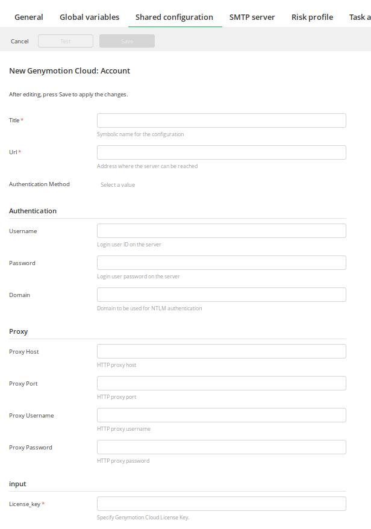
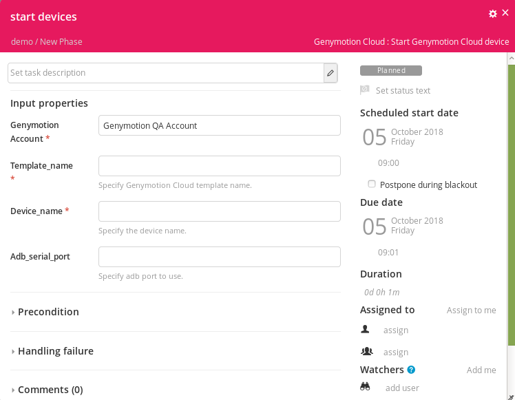
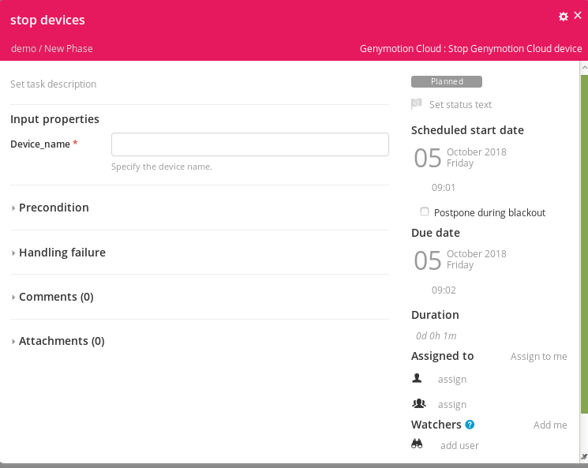

# xlr-genymotioncloud-plugin

## Preface

## Overview
Genymotion Cloud plugin for XL release allows the users to launch Android virtual devices on <a href="https://www.genymotion.com/cloud/">Genymotion Cloud Platform</a>.

## Pre requisites
<a href="https://www.genymotion.com/desktop/">Genymotion Desktop</a> with Entreprise License must be installed on the same server. For now, it's **mandatory** to add `gmtool` in the PATH.

## Installation

1. Download Genymotion Cloud plugin from the [release folder](../../releases).
2. Please refer to [How to install an XL Release plugin](https://docs.xebialabs.com/xl-release/how-to/install-or-remove-xl-release-plugins.html)

## Configuration
This configuration allows you to configure multiple Genymotion Account or just one.
Before using Genymotion Cloud start devices task, it's needed to setup a Genymotion Cloud server definition with the following information:

- **Title:** Name of the Genymotion Cloud Account
- **Url:** <a href="https://cloud.geny.io">https://cloud.geny.io</a>
- **Username:** Genymotion Cloud Account email.
- **Password:** Genymotion Cloud Account password
- **License_key:** Genymotion Cloud Account license key

## Tasks
The plugin has 2 different tasks.

#### Start devices
Start Devices task allows the user to start an Android device on Genymotion Cloud. 

This task takes 4 parameters: 

* **Genymotion Account**: It's the Genymotion account configured in Settigs/Shared configuration
* **Template name**: Set the desired template name. You can retrieve the list of available template on <a href="https://cloud.geny.io">Genymotion Cloud Platform</a>.
* **Device name**: Set the device name you want to start.
* **Adb serial port** :  Set the connection on a specific port, with a port comprised between 1024 and 65535. 

This task will use gmtool in order to start device on Genymotion Cloud and the device will be connected with adb on the server. 

#### Stop Devices
Stop Devices task allows the user to stop an Android device on Genymotion Cloud.

This task takes 1 parameter: 

* **Device name**: Set the device name you want to stop.

## References

* <a href="https://www.genymotion.com/">Genymotion</a>
* <a href="https://www.genymotion.com/cloud/">Genymotion Cloud</a>
* <a href="https://cloud.geny.io">Genymotion Cloud Platform</a>
